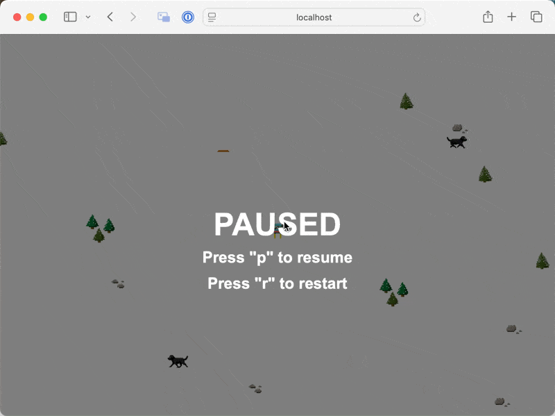

# Ceros Ski Code Challenge - TypeScript Edition



## [Live Demo here](https://andrewdw-ski-app-tq98u.ondigitalocean.app/)

## Running the Application

### Requirements

-   Node.js 18+
-   Docker 20+ (optional)

### Running locally with Docker (recommended)

`make dev` or `docker compose up` will run the application

### Running locally without Docker

1. `npm install`
2. `npm run dev`

### Running unit tests

`npm run test` will run the unit tests in the `src/Entities/*/__test__` directory

## Andrew's Modifications

-   Game was running really fast in Chrome (noted in Bugs below) so modified `STARTING_SPEED` and moved rhino further away for a more pleasurable game experience

-   Noticed the jump and skier flipping assets where in the image directory so added the image paths as constants

-   Because animation functionality was contained in rhino but very similar to the methods the skier needed I moved the logic to the `Entity` class

-   In an effort to extend functionality, created a base `Obstacle` class and extended it with `StaticObstacle`. `StaticObstacle` currently encompases every existing obstacle that doesn't move or animate

-   Created `ObstacleRegistry` type to better manage obstacles and assets

-   Generated a dog sprite in Dall-E and (poorly) modified it to look like it was walking. Added the assets in the game and created a `MovingObstacle` class to demonstrate the extenability of the codebase

-   Standardized the animation config in the `ObstacleRegistry` and added function to generate the config for each dog

-   Added ability to pause (with "p") the game by modifying the `Game` class to not update gameWindow if isPaused.

-   Also added listener for reset commands "r" and reset the obstacles, entities and game time

-   Encountered a bug (or feature) that pressing pause and unpause speeds up the game significantly. Prevented this by canceling the previous animation frames on each pause

-   Fixed the canvas not resizing with the window by adding a setupResizeHandling method to `Game` class with a window listener that sets teh canvas width & height on fire

-   Added unit tests for Obstacles in `src/Entities/Obstacles/__test__` that test the basic generation of new obsticals, their movement and expected thrown errors

-   Dockerized the application for running in prod

-   Lastly modified the `Skier` class to check if there's no longer an obstacle in the way before turning down (i.e. they hit a dog and it's gone, downarrow will move them again).

## Noted Bugs

-   The game appears to run faster on Chrome vs Safari

-   <s>Canvas does not resize with window until page is reloaded</s> Fixed (noted above)

## Original instructions

Welcome to the Ceros Ski Code Challenge!

For this challenge, we have included some base code for Ceros Ski, our version of the classic Windows game SkiFree. If
you've never heard of SkiFree, Google has plenty of examples. Better yet, you can play our version here:
http://ceros-ski.herokuapp.com/

Or deploy it locally by running:

```
npm install
npm run dev
```

**How To Play**

-   Use the arrow keys to turn the skier.
-   The skier will crash if they hit an obstacle. Use the left/right keys to move away from the obstacle and then down
    to resume skiing.
-   At some point the rhino will appear, chasing the skier. It will inevitably catch the skier and eat them, ending the
    game.

**Time Limit**

Solutions should be submitted within a week of receiving the challenge. We expect the challenge to take around two
hours of your time, but you may spend as long as you need to create a robust solution. We understand that everyone has
varying levels of free time, and we'd rather you take the time and produce a solution up to your ability than rush and
turn in a suboptimal challenge. If you require more time, please reach out to us. Look through the requirements below
and let us know when you will have something for us to look at. If anything is unclear, don't hesitate to reach out.

**Requirements**

Throughout your completion of these requirements, be mindful of the design/architecture of your solution and the
quality of your code. We've provided the base code as a sample of what we expect. That being said, we're sure there are
ways the that the design and architecture could be better. If you find a better way to do something, by all means, make
it better! Your solution can only gain from having a better foundation.

-   **Add a New Feature:**

    Add in the ability for the skier to jump. The asset files for the ramp and the jumping skier are included. All you
    need do is make them jump.

    Acceptance Criteria:

    -   Jump ramps are added to the game world and appear randomly as the skier skis.
    -   The skier should enter the jumping state when they hit the jump ramp.
    -   The skier should also enter the jumping state when the user presses the spacebar.
    -   The skier should do a flip while jumping, at least one cycle through the jump images provided.
    -   While jumping, the skier should be able to jump over some obstacles:
        -   Rocks can be jumped over
        -   Trees can NOT be jumped over

-   **Future Considerations**

    All products evolve over time. In the future, our game will have many more obstacles to crash into or interact with.
    Some of them may be animated as well, we're just waiting for our design department to provide the assets. Please
    make sure your code is written in a way that will make it easy to add these future features.

-   **Documentation:**

    Update this README file with your comments about your work.

    -   What did you do and, more importantly, why you built it the way you did.
    -   Are there any known bugs?
    -   Did you do any bonus items?
    -   Tell us how to run it, either locally or through a cloud provider.

-   **Be original:**

    This should go without saying but don’t copy someone else’s game implementation! We have access to Google too!

**Grading**

Your challenge will be graded based upon the following criteria. **Before spending time on any bonus items, make sure
you have fulfilled this criteria to the best of your ability, especially the quality of your code and the
design/architecture of your solutions. We cannot stress this enough!**

-   How well you've followed the instructions. Did you do everything we said you should do?
-   The quality of your code. We have a high standard for code quality and we expect all code to be up to production
    quality before it gets to code review. Is it clean, maintainable, unit-testable, and scalable?
-   The design of your solution and your ability to solve complex problems through simple and easy to read solutions.
-   How well you document your solution. We want to know what you did and **why** you did it.

**Bonus**

_Note: You won’t be marked down for excluding any of this, it’s purely bonus. If you’re really up against the clock,
make sure you complete all of the listed requirements and to focus on writing clean, well organized, well documented
code before taking on any of the bonus._

If you're having fun with this, feel free to add more to it. Here's some ideas or come up with your own. We love seeing
how creative candidates get with this.

-   Provide a way to reset the game once it's over
-   Provide a way to pause and resume the game
-   Add a score that increments as the skier skis further
-   Increase the difficulty the longer the skier skis (increase speed, increase obstacle frequency, etc.)
-   Deploy the game to a server so that we can play it without having to install it locally
-   Write unit tests for your code

We are looking forward to see what you come up with!!
